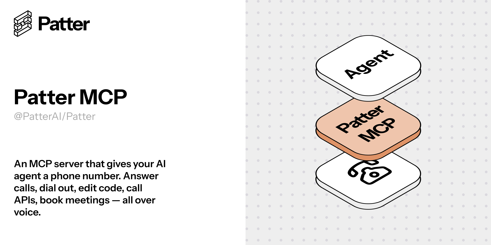

<p align="center">
  <picture>
    <source media="(prefers-color-scheme: dark)" srcset="./docs/github-banner.png" />
    <source media="(prefers-color-scheme: light)" srcset="./docs/github-banner.png" />
    
  </picture>
</p>

<p align="center">
  <a href="./LICENSE"></a>
  
  </a>
  <a href="https://github.com/PatterAI/Patter"></a>
</p>

<p align="center">
  <a href="#quickstart">Quickstart</a> •
  <a href="#features">Features</a> •
  <a href="#how-it-works">How It Works</a> •
  <a href="#configuration">Configuration</a>
</p>

---

An MCP server that gives your AI agent a phone number. Answer calls, dial out, edit code, call APIs, book meetings — all over voice.

Built on the [Patter](https://github.com/PatterAI/Patter) Voice AI SDK. Claude Code connects via Streamable HTTP and gets access to voice calling tools. During calls, the AI agent can read files, run commands, and search code in real time.

## Quickstart

### 1. Clone and install

```bash
git clone https://github.com/PatterAI/patter-mcp
cd patter-mcp
npm install
cp .env.example .env   # fill in your API keys
```

### 2. Start the server

```bash
npm run dev    # development
# or
npm run build && npm start   # production
```

### 3. Connect Claude Code

```bash
claude mcp add --transport http patter-mcp http://localhost:3000/mcp
```

### 4. Use it

Ask Claude:

> "Call +15551234567 and ask them about their order status"

> "Call this restaurant and ask if there's a table for 2 tonight"

> "Show me the transcript from the last call"

## Features

### MCP Tools

| Tool | Description |
|---|---|
| `make_call` | Place an outbound call with an AI voice agent |
| `call_third_party` | Call a third party with an autonomous task (e.g. restaurant reservation) |
| `get_calls` | List all calls with status, duration, and cost |
| `get_transcript` | Get the full conversation transcript of a call |

### Voice Tools (used by the AI agent during calls)

| Tool | Description |
|---|---|
| `read_file` | Read a file from the filesystem |
| `run_command` | Execute a shell command (30s timeout) |
| `search_code` | Search for a pattern in code files |

## How It Works

<table>
<tr>
<th align="center">Claude Code</th>
<th align="center"></th>
<th align="center">Patter MCP</th>
<th align="center"></th>
<th align="center">Phone Calls</th>
</tr>
<tr>
<td align="center">
  <strong>You</strong><br><sub>Claude Code / Desktop</sub><br><br>
  <code>make_call</code><br>
  <code>call_third_party</code><br>
  <code>get_transcript</code>
</td>
<td align="center">→</td>
<td align="center">
  <strong>MCP Server</strong><br>
  <em>Streamable HTTP :3000</em><br><br>
  <strong>Patter SDK</strong><br>
  <em>Twilio + STT/TTS :8000</em>
</td>
<td align="center">→</td>
<td align="center">
  <strong>Outbound</strong><br><sub>Call users & third parties</sub><br><br>
  <strong>Inbound</strong><br><sub>Answer on your number</sub>
</td>
</tr>
</table>

### Example: Claude Code calls the user

```
1. Claude Code needs approval for a plan
2. → make_call({ to: "+39...", systemPrompt: "Describe the plan..." })
3. Phone rings, user answers
4. AI agent: "Hi, I have a plan for the auth refactor..."
5. User: "Show me the current auth.ts file"
6. → read_file({ path: "src/auth.ts" })  [executes in <100ms]
7. AI agent: "The file has 45 lines, it uses JWT tokens..."
8. User: "Ok, proceed with the implementation"
9. Call ends → transcript returned to Claude Code
```

### Example: Call a restaurant

```
1. User: "Call the restaurant and ask if there's a table for 2 at 8pm"
2. → call_third_party({ to: "+39...", task: "ask for a table for 2 at 8pm" })
3. AI agent calls restaurant autonomously
4. Agent: "Buonasera, c'è un tavolo per due stasera alle 20?"
5. Restaurant: "Sì, abbiamo disponibilità"
6. → transcript returned to Claude Code
7. Claude: "The restaurant confirmed a table for 2 at 8pm tonight."
```

## Configuration

### Environment Variables

| Variable | Required | Description |
|---|---|---|
| `TWILIO_ACCOUNT_SID` | Yes | Twilio account SID |
| `TWILIO_AUTH_TOKEN` | Yes | Twilio auth token |
| `TWILIO_PHONE_NUMBER` | Yes | Your Twilio phone number (E.164) |
| `OPENAI_API_KEY` | Yes | OpenAI API key |
| `DEEPGRAM_API_KEY` | Yes | Deepgram STT key (for voice tools) |
| `ELEVENLABS_API_KEY` | Yes | ElevenLabs TTS key (for voice tools) |
| `MCP_PORT` | No | MCP server port (default: 3000) |
| `PATTER_PORT` | No | Patter server port (default: 8000) |
| `AGENT_SYSTEM_PROMPT` | No | Default system prompt for inbound calls |
| `AGENT_VOICE` | No | Default TTS voice (default: nova) |

```bash
cp .env.example .env
# Edit .env with your API keys
```

### Claude Desktop

Edit `~/Library/Application Support/Claude/claude_desktop_config.json`:

```json
{
  "mcpServers": {
    "patter-mcp": {
      "type": "http",
      "url": "http://localhost:3000/mcp"
    }
  }
}
```

## Development

```bash
npm run dev          # Run with tsx (auto-restart)
npm run build        # Build for production
npm start            # Run built version
```

## Contributing

Pull requests are welcome. Please open an issue before submitting large changes.

## License

MIT — see [LICENSE](./LICENSE).
